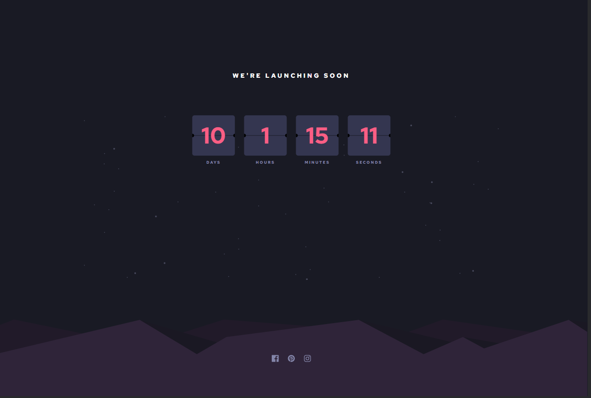

## Table of contents

- [Overview](#overview)
  - [The challenge](#the-challenge)
  - [Screenshot](#screenshot)
  - [Links](#links)
- [My process](#my-process)
  - [Built with](#built-with)
  - [What I learned](#what-i-learned)
  - [Continued development](#continued-development)
  - [Useful resources](#useful-resources)
- [Author](#author)

## Overview

### The challenge

Users should be able to:

- See hover states for all interactive elements on the page
- See a live countdown timer that ticks down every second (start the count at 14 days)

### Screenshot

### Links

- Solution URL: [GitHub](https://github.com/gabadadzeluca/launch-countdown-timer-main)
- Live Site URL: [Live URL](https://gabadadzeluca.github.io/launch-countdown-timer-main/)

## My process

### Built with

- Semantic HTML5 markup
- CSS custom properties
- Flexbox
- CSS Grid
- Mobile-first workflow

### What I learned

I learned about Date Object and its use in JavaScript.
Also I've styled and added elements to the page using the help of js.
I've used setInterval method for the constant change of value on the page. 

### Continued development

I wasn't fully able to split the divs into half, so the first and second half don't fully show but they coordinate as if it's one div.

### Useful resources

- [How to create costum timer](https://www.w3schools.com/howto/howto_js_countdown.asp) - This helped me understand Date Object and its methods in js, also converting units, which I didn't do myself.

## Author

- LinkedIn - [Luca Gabadadze](https://www.linkedin.com/in/luca-gabadadze-6068b324a/)

